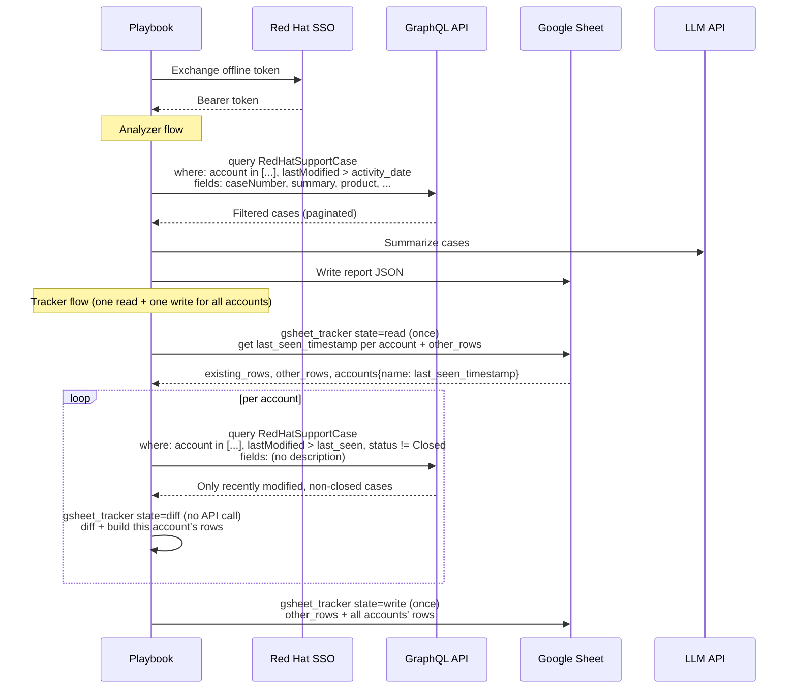

# Data Flow Summary

How both playbooks interact with external services after the GraphQL migration.

## Analyzer (`analyze_support_cases.yml`)

1. **SSO token exchange** — offline token → bearer token (unchanged).
2. **GraphQL fetch** — `graphql_cases` module posts a single query per account config,
   filtering by account number(s) and `activity_date` server-side. Cursor-based pagination
   collects all matching cases automatically (max 200 per page).
3. **LLM summarize** — case data sent to an OpenAI-compatible endpoint for AI insights.
4. **Report output** — templates render markdown, JSON, and optionally PDF reports.
   Google Sheets is updated via the `gsheet_update` module.

## Tracker (`track_support_cases.yml`)

1. **SSO token exchange** — same as analyzer.
2. **Read previous state once for every account** — `gsheet_tracker state=read` is called a
   single time (before the per-account loop, not inside it) and returns each account's
   `last_seen_timestamp`/`total_previous` plus `other_rows` (raw rows for accounts outside this
   run, preserved verbatim) and `existing_rows` (the full matrix, for the per-account diff step).
   A `tracker_last_run_date` extra var can override the cutoff; otherwise `activity_date` is the
   final fallback.
3. **GraphQL fetch (per account)** — `graphql_cases` with `include_description: false` and
   `status_filter: tracker_status_filter` (default `{ne: "Closed"}`) fetches only non-closed
   cases modified since the cutoff, reducing payload size and ensuring closed cases fall out of
   the "active" set the diff compares against.
4. **Diff (per account, no API calls)** — `gsheet_tracker state=diff` compares current cases
   against the relevant slice of `existing_rows`, returns new/closed/updated case lists, and
   builds that account's replacement rows (accumulated into a playbook-level fact).
5. **Write once** — after every account has been processed, `gsheet_tracker state=write` writes
   `other_rows` + every account's accumulated rows in a single clear+rewrite, and maintains a
   Sheets API Table (`gsheet_table_name`, defaults to `gsheet_sheet`) over the result.
6. **Email notification** — `community.general.mail` sends a change summary if any account
   has diffs (or always, when `tracker_notify_on_no_changes: true`).
