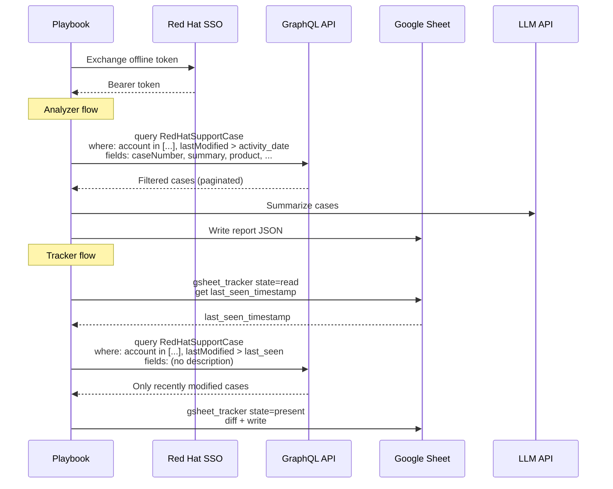

# Data Flow Summary

How both playbooks interact with external services after the GraphQL migration.

## Analyzer (`analyze_support_cases.yml`)

1. **SSO token exchange** — offline token → bearer token (unchanged).
2. **GraphQL fetch** — `graphql_cases` module posts a single query per account config,
   filtering by account number(s) and `activity_date` server-side. Cursor-based pagination
   collects all matching cases automatically (max 200 per page).
3. **LLM summarize** — case data sent to an OpenAI-compatible endpoint for AI insights.
4. **Report output** — templates render markdown, JSON, and optionally PDF reports.
   Google Sheets is updated via the `gsheet_update` module.

## Tracker (`track_support_cases.yml`)

1. **SSO token exchange** — same as analyzer.
2. **Read previous state** — `gsheet_tracker state=read` returns the `last_seen_timestamp`
   from the tracker sheet without writing. A `tracker_last_run_date` extra var can override
   this; otherwise `activity_date` is the final fallback.
3. **GraphQL fetch** — `graphql_cases` with `include_description: false` fetches only cases
   modified since the cutoff, reducing payload size.
4. **Diff + write** — `gsheet_tracker state=present` compares current cases against previous
   rows, writes updated rows, and returns new/closed/updated case lists.
5. **Email notification** — `community.general.mail` sends a change summary if any account
   has diffs (or always, when `tracker_notify_on_no_changes: true`).
